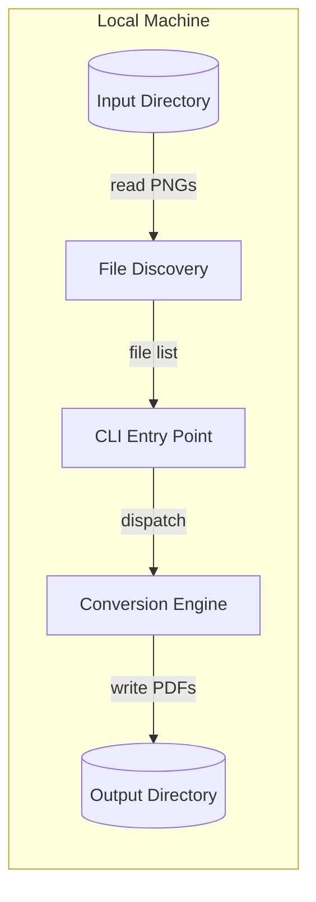
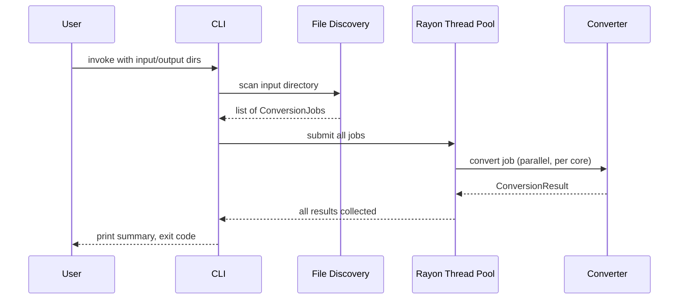
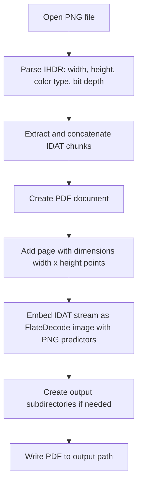

# PNG-to-PDF Converter — High-Level Design

## 1. Overview

A single-binary Rust CLI tool that batch-converts PNG files to PDF documents locally on macOS (Apple Silicon). The tool recursively discovers PNGs in a source directory, converts each to a single-page PDF with matching page dimensions, and writes results to a separate output directory preserving the folder hierarchy. Parallelism via `rayon` saturates available cores for throughput.

## 2. Architecture Summary



## 3. Core Components

### 3.1 CLI Entry Point

Parses command-line arguments, validates inputs, orchestrates the pipeline (discover → convert → report), and manages exit codes.

| Subcomponent | Responsibility | Communicates With |
|---|---|---|
| **Argument Parser** | Parse and validate CLI flags and positional args | File Discovery, Conversion Engine |
| **Progress Reporter** | Display file counts, progress, and summary | stdout/stderr |

### 3.2 File Discovery

Recursively walks the input directory tree, filters for PNG files (case-insensitive extension match), skips hidden entries, and produces an ordered list of conversion jobs.

| Subcomponent | Responsibility | Communicates With |
|---|---|---|
| **Directory Walker** | Recursive traversal with filtering | Filesystem |
| **Path Mapper** | Compute relative paths and derive output paths | Conversion Engine |

### 3.3 Conversion Engine

Takes a list of (input path, output path) pairs and converts them in parallel. Each conversion parses the PNG (header for dimensions, IDAT chunks for the compressed stream), then writes a single-page PDF embedding the raw compressed data via FlateDecode with PNG predictors.

| Subcomponent | Responsibility | Communicates With |
|---|---|---|
| **PNG Parser** | Parse IHDR for dimensions/color info, extract concatenated IDAT stream | Filesystem |
| **PDF Writer** | Construct PDF with page matching image dimensions, embed IDAT stream with FlateDecode + Predictor 15 | Filesystem |
| **Parallel Executor** | Distribute work across CPU cores via rayon | PNG Parser, PDF Writer |

## 4. Data Models

### 4.1 Core Data Structures

This tool has no persistent data model — it transforms files in a single pass. The key in-memory structures are:

| Structure | Purpose | Key Attributes |
|---|---|---|
| **ConversionJob** | One unit of work | input_path, output_path, relative_path |
| **ConversionResult** | Outcome of one job | job, status (success/failed), error message, duration |
| **BatchSummary** | Aggregated results | total, succeeded, failed, elapsed time |

### 4.2 Data Lifecycle

Data flows one-way: PNG bytes are read from disk, wrapped in a PDF container, and written to disk. No intermediate files, no caching, no state persisted between runs.

## 5. Data Flows

### 5.1 Conversion Pipeline



### 5.2 Single File Conversion



### 5.3 Failure Paths

- **Single file read error** (permissions, corrupt header): logged to stderr, marked as failed in results, batch continues.
- **Single file write error** (disk full, permissions): same handling — logged and skipped.
- **Input directory does not exist**: immediate exit with error message, exit code 1.
- **All files fail**: batch completes, summary shows 0 succeeded / N failed, exit code 1.

## 6. Key Design Decisions

### 6.1 Raw PNG Embedding (no decode/re-encode)

**Decision:** Embed the PNG byte stream directly into the PDF rather than decoding to pixels and re-encoding.

**Rationale:**
- Bit-for-bit image preservation — zero quality loss
- Faster — no decode or re-encode step
- Smaller output files — no re-compression overhead

**Alternatives considered:**

| Alternative | Why Not |
|---|---|
| Decode PNG then embed raw pixels | Larger files, slower, no quality benefit |
| Decode and re-encode as JPEG in PDF | Lossy — violates requirement for full quality |

### 6.2 pdf-writer with Raw PNG Stream Pass-Through

**Decision:** Use the `pdf-writer` crate for PDF generation, embedding the raw compressed IDAT stream from each PNG directly into the PDF using FlateDecode with PNG predictors.

**Rationale:**
- No decode/re-encode round-trip — the PNG's internal zlib-compressed predictor-filtered scanlines are exactly what PDF's FlateDecode with Predictor 15 expects
- Bit-for-bit image preservation with zero quality loss
- Faster (no pixel decoding) and smaller output files (no re-compression overhead)
- pdf-writer's API supports `Filter::FlateDecode` with `DecodeParms` (predictor, colors, bits_per_component, columns)

**Embedding approach:**
1. Parse PNG with `png` crate to extract: width, height, color type, bit depth, raw IDAT chunks
2. Concatenate IDAT chunks (raw zlib/deflate stream of predictor-filtered scanlines)
3. Write as PDF image XObject with FlateDecode filter and PNG predictor DecodeParms

**Alternatives considered:**

| Alternative | Why Not |
|---|---|
| `printpdf` | Decodes images internally, re-encodes — unnecessary overhead for pass-through embedding |
| pdf-writer with pixel decode + re-encode | Works (official example does this) but slower and produces larger files — no benefit |
| `lopdf` | Lower-level still, more manual PDF construction, less ergonomic |

### 6.3 Rayon for Parallelism

**Decision:** Use `rayon`'s parallel iterator for concurrent file processing.

**Rationale:**
- Work-stealing scheduler automatically balances across cores
- Zero-config — defaults to using all available cores
- Trivial to integrate (`par_iter()` drop-in for `iter()`)
- Well-proven in the Rust ecosystem

**Alternatives considered:**

| Alternative | Why Not |
|---|---|
| `tokio` (async) | This is CPU+IO bound on local disk — async adds complexity without benefit for local FS operations |
| Manual `std::thread` pool | More code, no work-stealing, rayon is strictly better here |

### 6.4 Manual PNG Chunk Parsing (no `png` crate)

**Decision:** Parse PNG chunks manually rather than using the `png` crate.

**Rationale:**
- The `png` crate's API does NOT expose raw IDAT chunk data — it only provides decoded pixels
- Its `set_captured_chunks()` explicitly rejects critical chunks (IHDR, IDAT, IEND)
- Manual chunk parsing is trivial for our needs: signature → IHDR → iterate collecting IDAT → stop at IEND
- Eliminates a dependency that cannot serve our core requirement (raw IDAT pass-through)
- CRC validation is optional — corrupted IDAT will fail at PDF render time anyway; use `crc32fast` if desired

**Interlace handling:** Reject PNGs with interlace_method != 0. PDF FlateDecode with Predictor 15 expects non-interlaced scanlines. Interlaced PNGs cannot be passed through without full decode/re-encode (out of scope).

**Alternatives considered:**

| Alternative | Why Not |
|---|---|
| `png` crate | Cannot expose raw IDAT data — only decodes pixels. Would force decode/re-encode path. |
| `image` crate | Even heavier; same decode-only limitation |
| `png` crate for IHDR only + manual IDAT | Adds a dependency for 13 bytes of parsing that's simpler to do inline |

## 7. Security Architecture

### 7.1 Trust Model

This is a local-only CLI tool with no network access, no authentication, and no multi-user concerns. The security boundary is the local filesystem.

### 7.2 Filesystem Access

| Concern | Mitigation |
|---|---|
| Path traversal in file names | Tool only writes within the user-specified output directory; relative paths are resolved against it |
| Symlink following | Standard directory walker follows symlinks — acceptable for local CLI use |
| Overwriting unintended files | Output is confined to the output directory argument |

### 7.3 Input Validation

- PNG header is validated before embedding (magic bytes + IHDR chunk integrity)
- Malformed files are skipped, not processed — no attempt to "fix" corrupt data

## 8. Deployment Model

### 8.1 Distribution

Single statically-linked binary. No containers, no infrastructure, no services.


### 8.2 Local Development

```bash
cargo run -- <input-dir> <output-dir>
```

No external dependencies to install. No Docker. No configuration files.

### 8.3 Requirements

| Resource | Purpose | Sizing |
|---|---|---|
| Rust toolchain | Build the binary | Latest stable (1.70+) |
| Disk space | Output PDFs | ~1:1 ratio with input PNGs (PDF wrapper adds minimal overhead) |
| RAM | Parallel file processing | ~N concurrent files x largest file size; negligible for typical use |

## 9. Technology Choices

| Category | Choice | Rationale |
|---|---|---|
| Language | Rust | User preference; single binary, no runtime, excellent performance |
| PDF Generation | `pdf-writer` | Direct PNG stream embedding, low-level control, no unnecessary decoding |
| Parallelism | `rayon` | Work-stealing, zero-config, ergonomic parallel iterators |
| CLI Parsing | `clap` (derive) | De facto standard for Rust CLIs, compile-time validation |
| Directory Walking | `walkdir` | Battle-tested recursive traversal with filtering |
| PNG Parsing | Manual chunk iteration | `png` crate cannot expose raw IDAT data; manual parsing is trivial and eliminates the dependency |
| Progress Display | `indicatif` | Progress bars and counters, integrates with rayon |
| Error Handling | `anyhow` | Ergonomic error context for CLI applications |

## 10. What This Design Defers

- [ ] Multi-format support (JPEG, TIFF, etc.) — keep scope minimal for v1
- [ ] Multi-page PDF merging — different use case, different CLI interface
- [ ] Image preprocessing (rotation, deskew) — out of scope per requirements
- [ ] Cross-platform builds (Windows, Linux) — primary target is macOS aarch64
- [ ] Configuration file support — CLI flags are sufficient for this tool's scope

### 6.5 Page Dimensions: 1 Pixel = 1 Point (Ignore DPI)

**Decision:** Always map 1 pixel to 1 PDF point regardless of any pHYs (DPI) metadata in the PNG.

**Rationale:**
- Analysis of actual input files (91 HVAC schematics) shows 87/91 have NO pHYs chunk at all
- The 4 files with pHYs all report 96 DPI (generic screen default, meaningless for scanned engineering drawings)
- These are large-format schematics (up to 14292×5905 px) — large PDF pages are appropriate; viewers zoom-to-fit
- Simpler implementation: no conditional DPI logic

**Alternatives considered:**

| Alternative | Why Not |
|---|---|
| Respect pHYs when present | Inconsistent behavior across the batch (some pages DPI-sized, most pixel-sized); 96 DPI metadata is meaningless anyway |
| Default to A4/Letter fitting | Would distort aspect ratios or leave whitespace; requirements explicitly state page = image dimensions |

## 11. Open Questions

None — the design is fully determined by the requirements and technology choices above.

---

*This is a high-level architecture document. Code structure, class design, and implementation details belong in the low-level design document.*
