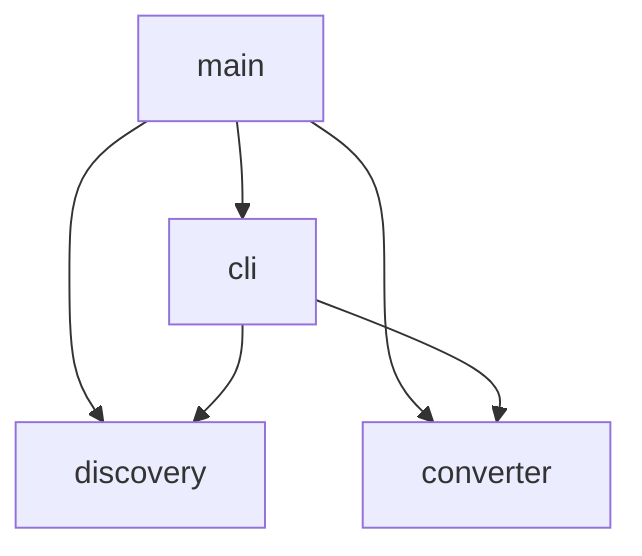
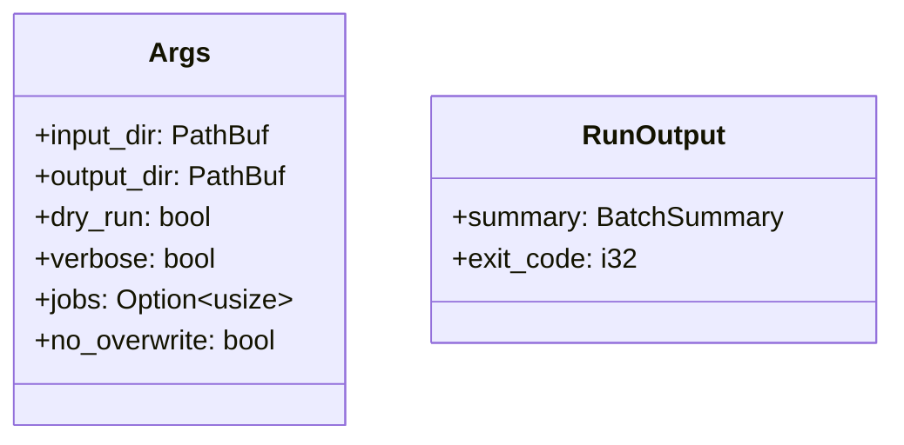
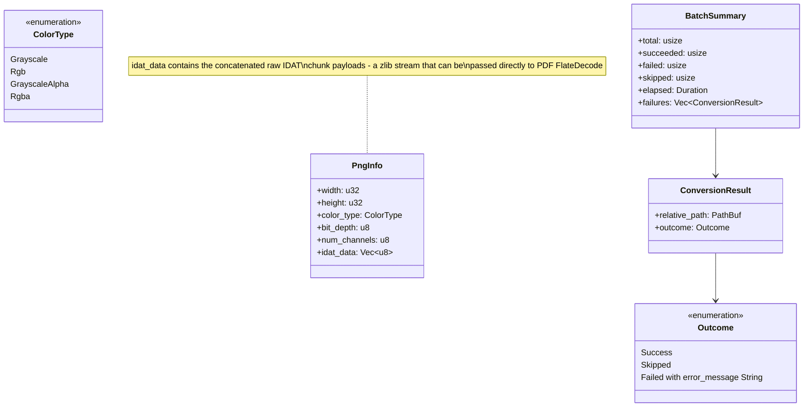
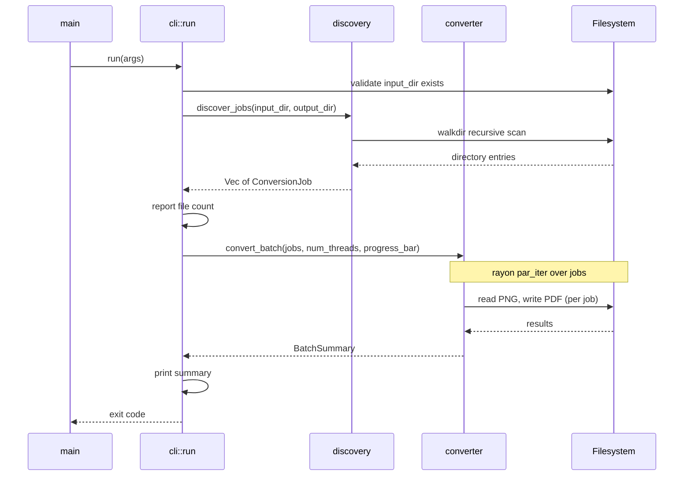
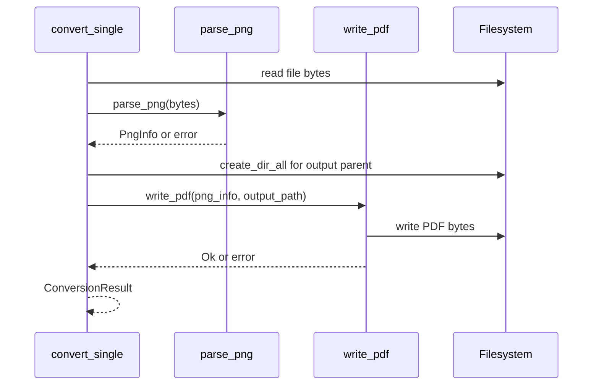
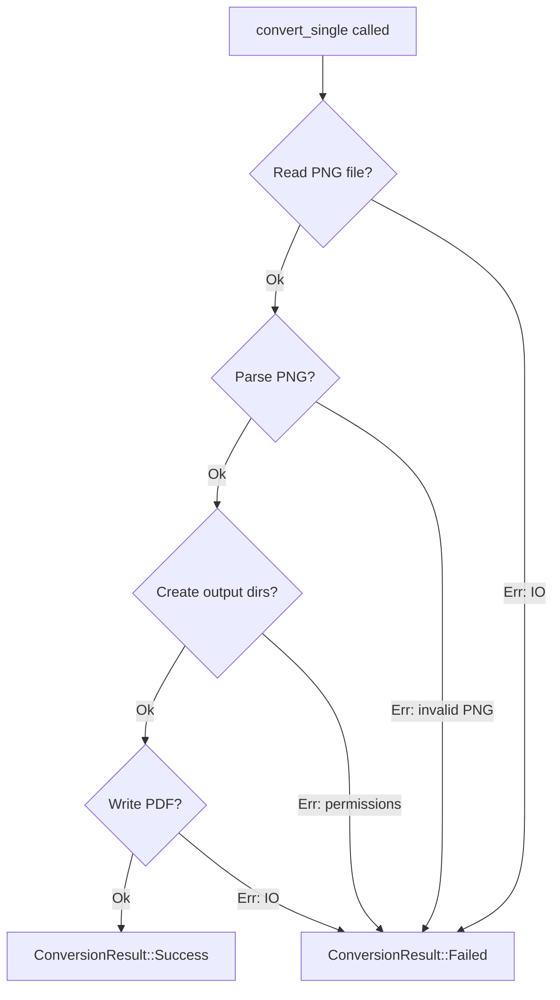
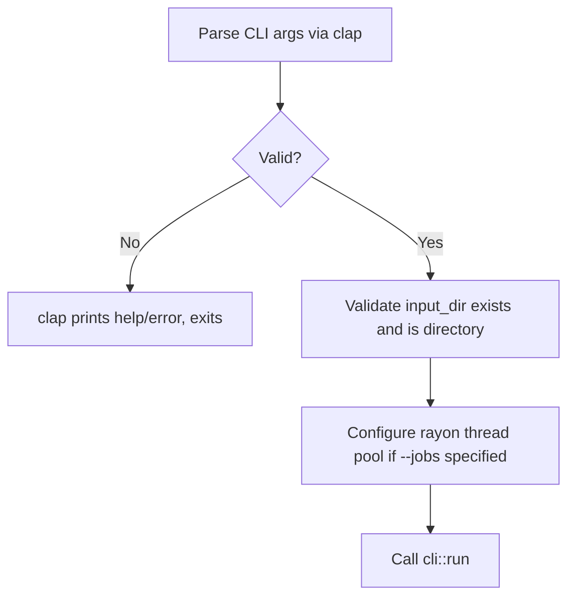

# PNG-to-PDF Converter — Low-Level Design

## 1. Overview

This document specifies the code structure, module interfaces, type design, and testing strategy for the PNG-to-PDF converter CLI tool. It implements the architecture described in the high-level design: a single Rust binary using `pdf-writer` for PDF generation with raw PNG IDAT pass-through, manual PNG chunk parsing (no `png` crate — it cannot expose raw IDAT data), `rayon` for parallelism, and `clap` for CLI argument handling.

**Prerequisites:**
- [Requirements Document](converter-requirements.md)
- [High-Level Design](converter-high-level-design.md)

## 2. Package/Module Structure

### 2.1 Module Dependency Graph

Single crate with four modules under `src/`:

### 2.2 Module Details

| Module | Purpose | Public Exports | Internal Dependencies |
|--------|---------|---------------|----------------------|
| `main` | Entry point, orchestration, exit code | — | cli, discovery, converter |
| `cli` | Argument parsing, progress display, summary output | `Args`, `run` | discovery, converter |
| `discovery` | Directory traversal, path mapping, job creation | `discover_jobs`, `ConversionJob` | — |
| `converter` | PNG parsing, PDF writing, parallel execution | `convert_batch`, `convert_single`, `ConversionResult`, `BatchSummary` | — |

### 2.3 `cli` — Detail

Owns argument parsing via `clap` derive macros, invokes discovery and conversion, manages the `indicatif` progress bar, and prints the final summary. Returns the appropriate exit code to `main`.

**Exports:**
- `Args` — clap-derived struct with all CLI parameters
- `run(args: Args) -> Result<BatchSummary>` — orchestrates the full pipeline

### 2.4 `discovery` — Detail

Recursively walks the input directory using `walkdir`, applies PNG extension filter (case-insensitive) and hidden-file exclusion, computes output paths by rebasing the relative path onto the output directory.

**Exports:**
- `ConversionJob` — struct holding input_path, output_path, relative_path
- `discover_jobs(input_dir: &Path, output_dir: &Path) -> Result<Vec<ConversionJob>>` — performs discovery

### 2.5 `converter` — Detail

Contains manual PNG chunk parsing (signature validation, IHDR extraction, IDAT concatenation) and PDF construction logic via `pdf-writer`. The `png` crate is NOT used — its API does not expose raw IDAT chunk data, which we need for zero-copy pass-through to PDF.

**PNG parsing approach:** Read the 8-byte PNG signature, parse the 13-byte IHDR payload (width, height, bit_depth, color_type, interlace_method), then iterate chunks (4-byte length + 4-byte type + data + 4-byte CRC) collecting all IDAT payloads until IEND. Reject interlaced PNGs (interlace_method != 0) since PDF FlateDecode with Predictor 15 requires non-interlaced scanlines.

**Exports:**
- `convert_single(job: &ConversionJob) -> ConversionResult` — converts one file
- `convert_batch(jobs: &[ConversionJob], num_threads: Option<usize>, progress: &ProgressBar) -> BatchSummary` — parallel batch
- `ConversionResult` — per-file outcome
- `BatchSummary` — aggregated counts and timing

## 3. Class Diagrams

### 3.1 CLI Module

### 3.2 Discovery Module

### 3.3 Converter Module

### 3.4 Key Type Definitions

| Type | Purpose | Key Fields | Constraints |
|------|---------|-----------|-------------|
| `Args` | CLI arguments | input_dir, output_dir, dry_run, verbose, jobs, no_overwrite | input_dir must exist and be a directory |
| `ConversionJob` | Unit of work | input_path, output_path, relative_path | input_path must be a file |
| `PngInfo` | Parsed PNG metadata + data | width, height, color_type, bit_depth, num_channels, idat_data | width and height > 0; idat_data is concatenated raw IDAT payloads (zlib stream); interlace_method must be 0 |
| `ConversionResult` | Outcome of one conversion | relative_path, outcome | Always produced — never panics |
| `BatchSummary` | Aggregate statistics | total, succeeded, failed, skipped, elapsed, failures | total = succeeded + failed + skipped |

## 4. Class Interactions

### 4.1 Full Pipeline

**Covers requirements:** FR-3.1.1, FR-3.1.2, FR-3.2.1, FR-3.2.2, FR-3.3.1, FR-3.3.3, FR-3.4.1

### 4.2 Single File Conversion (internal to converter)

**Covers requirements:** FR-3.2.1, FR-3.2.2, FR-3.4.1

### 4.3 Error Propagation

## 5. Data Access Layer

Not applicable — this tool has no database or persistent storage. All data access is filesystem I/O:

| Operation | Pattern | Notes |
|-----------|---------|-------|
| Read PNG | `std::fs::read` (full file into memory) | Simplest; files are 1-6 MB typically |
| Write PDF | `std::fs::write` (atomic write of completed buffer) | PDF is built in memory, then flushed once |
| Create directories | `std::fs::create_dir_all` | Idempotent; creates full path |
| Check file exists | `Path::exists` | For `--no-overwrite` skip logic |

## 6. Error Handling Strategy

### 6.1 Error Type Hierarchy

| Error Context | Variants | Source |
|---------------|----------|--------|
| Discovery errors | Input dir not found, input is not a directory, permission denied during walk | `std::io::Error`, `walkdir::Error` |
| PNG parse errors | Not a valid PNG (bad magic), malformed IHDR, no IDAT chunks found, unsupported color type | `png` crate errors |
| PDF write errors | IO error creating directories, IO error writing file | `std::io::Error` |

### 6.2 Error Mapping

| Error Source | User-Facing Behavior | Exit Code |
|---|---|---|
| Input directory missing | Print error message, exit immediately | 1 |
| Input not a directory | Print error message, exit immediately | 1 |
| Single file parse/read failure | Print to stderr, continue batch | 1 (at end) |
| Single file write failure | Print to stderr, continue batch | 1 (at end) |
| All files succeed | Print summary | 0 |

### 6.3 Error Crate Usage

- `anyhow::Result` for the top-level pipeline (discovery can fail fatally)
- `convert_single` never returns `Result` — it catches all errors internally and returns `ConversionResult` with the `Failed` variant. This ensures rayon's parallel iterator never panics.

## 7. Configuration & Wiring

### 7.1 Startup Sequence

### 7.2 Dependency Wiring

No dependency injection framework. The application is wired directly in `main`:

1. `main` calls `Args::parse()` (clap)
2. `main` calls `cli::run(args)` which orchestrates everything
3. `cli::run` calls `discovery::discover_jobs` directly
4. `cli::run` calls `converter::convert_batch` directly
5. If `--jobs` is specified, a custom `rayon::ThreadPoolBuilder` is configured before calling `convert_batch`

No traits, no indirection, no DI — the tool is simple enough that direct function calls are appropriate.

### 7.3 Configuration Parameters

| Parameter | Type | Default | Required | Source |
|-----------|------|---------|----------|--------|
| `input_dir` | PathBuf | — | Yes | CLI positional arg |
| `output_dir` | PathBuf | — | Yes | CLI positional arg |
| `--dry-run` | bool | false | No | CLI flag |
| `--verbose` / `-v` | bool | false | No | CLI flag |
| `--jobs` / `-j` | Option\<usize\> | None (all cores) | No | CLI flag |
| `--no-overwrite` | bool | false | No | CLI flag |

## 8. Testing Strategy

### 8.1 Unit Tests — Per Module

#### Discovery Module Tests

| Function | Test | Verifies (Requirement) | Description |
|----------|------|----------------------|-------------|
| `discover_jobs` | `test_finds_png_files` | FR-3.1.1 | Given a temp dir with PNG files, returns correct jobs |
| `discover_jobs` | `test_recursive_traversal` | FR-3.1.1 | Given nested subdirs with PNGs, finds all of them |
| `discover_jobs` | `test_case_insensitive_extension` | FR-3.1.2 | Files with .PNG, .Png, .pNg are all discovered |
| `discover_jobs` | `test_skips_non_png` | FR-3.1.2 | .jpg, .txt, .pdf files are not included |
| `discover_jobs` | `test_skips_hidden_files` | FR-3.1.2 | Files/dirs starting with `.` are excluded |
| `discover_jobs` | `test_output_path_mapping` | FR-3.2.2 | Output paths mirror relative structure with .pdf extension |
| `discover_jobs` | `test_empty_directory` | FR-3.1.1 | Returns empty vec, no error |

#### Converter Module Tests

| Function | Test | Verifies (Requirement) | Description |
|----------|------|----------------------|-------------|
| `parse_png` | `test_parses_valid_rgb_png` | FR-3.2.1 | Extracts correct width, height, color_type, idat_data from a known RGB PNG |
| `parse_png` | `test_parses_rgba_png` | FR-3.2.1 | Handles RGBA PNGs (4 color components) |
| `parse_png` | `test_parses_grayscale_png` | FR-3.2.1 | Handles grayscale (1 component) |
| `parse_png` | `test_concatenates_multiple_idat_chunks` | FR-3.2.1 | PNG with multiple IDAT chunks produces single continuous zlib stream |
| `parse_png` | `test_rejects_interlaced_png` | FR-3.2.1 | Returns error for interlaced (Adam7) PNGs — cannot pass-through to PDF |
| `parse_png` | `test_rejects_invalid_png` | FR-3.4.1 | Returns error for non-PNG data (bad magic bytes) |
| `parse_png` | `test_rejects_truncated_png` | FR-3.4.1 | Returns error for truncated file (incomplete chunk) |
| `parse_png` | `test_rejects_missing_idat` | FR-3.4.1 | Returns error for PNG with no IDAT chunks |
| `write_pdf` | `test_produces_valid_pdf` | FR-3.2.1 | Output bytes start with `%PDF-` header |
| `write_pdf` | `test_page_dimensions_match` | FR-3.2.1 | PDF page width/height in points equals PNG pixel dimensions |
| `convert_single` | `test_creates_output_directories` | FR-3.2.2 | Parent dirs of output_path are created |
| `convert_single` | `test_skips_existing_when_no_overwrite` | FR-3.4.3 | With no_overwrite=true, existing output → Skipped |
| `convert_single` | `test_overwrites_existing_by_default` | FR-3.4.3 | Without no_overwrite, existing file is replaced |
| `convert_single` | `test_returns_failed_on_bad_input` | FR-3.4.1 | Corrupt PNG → Failed result, no panic |
| `convert_batch` | `test_parallel_execution` | NFR-4.1 | Multiple files processed; all results returned |
| `convert_batch` | `test_continues_on_failure` | FR-3.4.1 | One bad file doesn't stop the rest |

#### CLI Module Tests

| Function | Test | Verifies (Requirement) | Description |
|----------|------|----------------------|-------------|
| `Args` | `test_required_args` | FR-3.3.1 | Parsing fails without input_dir and output_dir |
| `Args` | `test_all_flags_parse` | FR-3.3.2 | --dry-run, -v, -j 4, --no-overwrite all parse correctly |
| `run` | `test_nonexistent_input_returns_error` | FR-3.4.2 | Missing input dir → error before discovery |
| `run` | `test_input_not_directory_returns_error` | FR-3.4.2 | File path as input → error |
| `run` | `test_creates_output_dir` | FR-3.4.2 | Non-existent output dir is created |
| `run` | `test_dry_run_no_output_files` | FR-3.3.2 | With --dry-run, no PDFs are written |
| `run` | `test_exit_code_zero_on_success` | FR-3.4.1 | All succeed → exit 0 |
| `run` | `test_exit_code_one_on_any_failure` | FR-3.4.1 | Any failure → exit 1 |

### 8.2 Integration Tests

| Test | Requirements Covered | Setup | Exercise | Assert |
|------|---------------------|-------|----------|--------|
| `test_full_pipeline_small_batch` | FR-3.1.1, FR-3.2.1, FR-3.2.2, FR-3.3.3 | Temp dir with 3 PNG files (1 RGB, 1 RGBA, 1 grayscale) in flat structure | Run `cli::run` with input/output dirs | 3 PDFs created, each starts with %PDF-, page dimensions match source PNGs |
| `test_full_pipeline_nested_dirs` | FR-3.1.1, FR-3.2.2 | Temp dir with PNGs in sub/sub/dirs | Run `cli::run` | Output mirrors directory structure exactly |
| `test_full_pipeline_mixed_files` | FR-3.1.2 | Temp dir with PNGs + .jpg + .txt + hidden files | Run `cli::run` | Only PNGs converted; others ignored |
| `test_full_pipeline_with_failures` | FR-3.4.1 | Temp dir with 2 valid PNGs + 1 corrupt file (renamed .png) | Run `cli::run` | 2 succeed, 1 fails, exit code 1, summary correct |
| `test_large_image_dimensions` | FR-3.2.1 | Create a 10000x5000 minimal PNG programmatically | Run `convert_single` | PDF page is 10000x5000 points |
| `test_output_pdf_opens_correctly` | FR-3.2.1 | Convert a known test PNG | Parse output PDF structure (check XObject filter is FlateDecode, DecodeParms has Predictor 15) | PDF is structurally valid with correct image embedding |

### 8.3 Requirements Traceability Matrix

| Requirement | Unit Tests | Integration Tests | Notes |
|-------------|-----------|------------------|-------|
| FR-3.1.1 | `test_finds_png_files`, `test_recursive_traversal`, `test_empty_directory` | `test_full_pipeline_small_batch`, `test_full_pipeline_nested_dirs` | |
| FR-3.1.2 | `test_case_insensitive_extension`, `test_skips_non_png`, `test_skips_hidden_files` | `test_full_pipeline_mixed_files` | |
| FR-3.2.1 | `test_parses_valid_rgb_png`, `test_produces_valid_pdf`, `test_page_dimensions_match` | `test_full_pipeline_small_batch`, `test_large_image_dimensions`, `test_output_pdf_opens_correctly` | |
| FR-3.2.2 | `test_output_path_mapping`, `test_creates_output_directories` | `test_full_pipeline_nested_dirs` | |
| FR-3.3.1 | `test_required_args` | — | Covered by clap derive |
| FR-3.3.2 | `test_all_flags_parse`, `test_dry_run_no_output_files` | — | |
| FR-3.3.3 | — | `test_full_pipeline_small_batch` | Verify summary output in stdout |
| FR-3.4.1 | `test_returns_failed_on_bad_input`, `test_continues_on_failure`, `test_exit_code_one_on_any_failure` | `test_full_pipeline_with_failures` | |
| FR-3.4.2 | `test_nonexistent_input_returns_error`, `test_input_not_directory_returns_error`, `test_creates_output_dir` | — | |
| FR-3.4.3 | `test_skips_existing_when_no_overwrite`, `test_overwrites_existing_by_default` | — | |
| NFR-4.1 | `test_parallel_execution` | — | Rayon handles; basic sanity check |

### 8.4 Test Infrastructure

**Test Fixtures:**
- Small PNG files (16x16 or 32x32) in RGB, RGBA, and Grayscale color types, committed to `tests/fixtures/`
- One corrupt file (valid .png extension, invalid content) in fixtures
- Fixtures are minimal — created with the `png` crate's encoder in a build script or committed as small binary files

**Test Utilities:**
- `TempDir` from the `tempfile` crate for isolated test directories
- Helper function to create minimal PNGs programmatically (for tests that need specific dimensions or color types)
- Helper function to validate PDF structure (check magic bytes, parse for XObject presence)

**No test doubles needed** — all dependencies are the filesystem, and `tempfile::TempDir` provides isolation. No traits to mock.

## 9. Open Questions

None. The design is fully specified for implementation.

---

*This low-level design is detailed enough for an implementer to create a task breakdown and begin coding without architectural ambiguity. All module designs and test plans trace back to the [requirements document](converter-requirements.md) and are consistent with the [high-level design](converter-high-level-design.md).*
