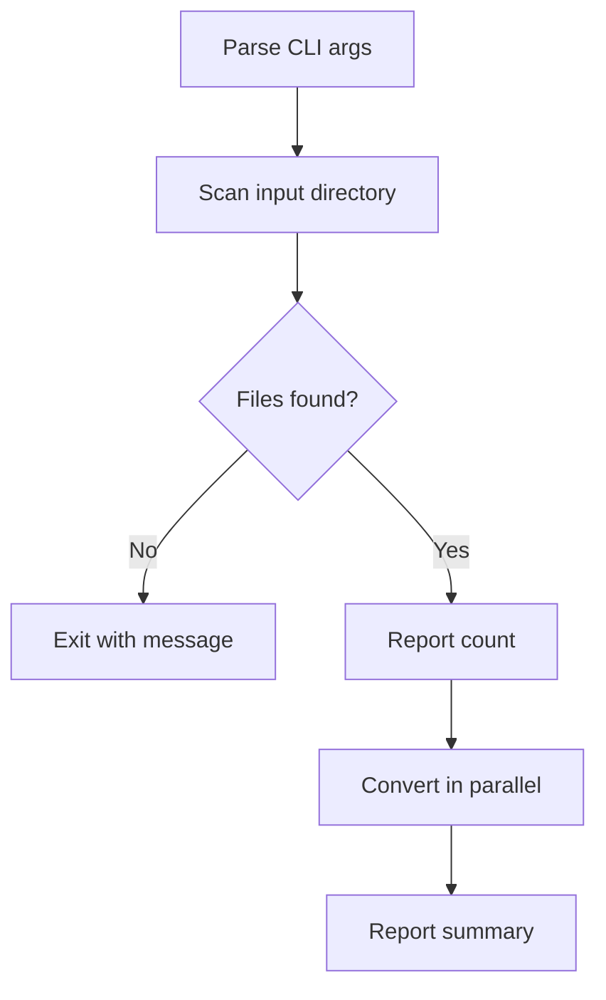

# PNG-to-PDF Converter - Requirements

## 1. Overview

A local Rust CLI tool that batch-converts PNG image files to PDF documents. Each PNG produces a single-page PDF where the page dimensions match the source image. The tool accepts an input directory (recursing into subdirectories) and writes PDFs to a separate output directory, preserving the directory structure.

## 2. Core Concepts

### 2.1 Terminology

| Term | Definition |
|------|------------|
| **Source directory** | The input folder containing PNG files to convert |
| **Output directory** | The target folder where generated PDFs are written |
| **Structure mirroring** | Recreating the subdirectory hierarchy from source in output |

### 2.2 Data Flow

## 3. Functional Requirements

### 3.1 File Discovery

#### FR-3.1.1 Recursive Directory Traversal
- System SHALL recursively scan the source directory for files with `.png` extension (case-insensitive)
- System SHALL skip non-PNG files without error
- System SHALL follow the directory tree to arbitrary depth

#### FR-3.1.2 File Filtering
- System SHALL match files by extension only (`.png`, `.PNG`, `.Png`, etc.)
- System SHALL ignore hidden files and directories (prefixed with `.`)

### 3.2 Conversion

#### FR-3.2.1 PNG to PDF Conversion
- System SHALL produce one PDF file per input PNG
- System SHALL set the PDF page dimensions to match the PNG pixel dimensions (1 pixel = 1 point)
- System SHALL embed the PNG image data into the PDF page at full quality (no lossy re-encoding)
- System SHALL name the output file identically to the input file but with `.pdf` extension (e.g., `scan_001.png` becomes `scan_001.pdf`)

#### FR-3.2.2 Directory Structure Preservation
- System SHALL mirror the relative directory structure from source into the output directory
- System SHALL create subdirectories in the output as needed
- Example: `input/sub/page.png` with output dir `output/` produces `output/sub/page.pdf`

### 3.3 CLI Interface

#### FR-3.3.1 Required Arguments
- System SHALL accept an input directory path (positional or via flag)
- System SHALL accept an output directory path (positional or via flag)

#### FR-3.3.2 Behavior Options
- System SHOULD support a `--dry-run` flag that lists files to be converted without performing conversion
- System SHOULD support a `--verbose` / `-v` flag for detailed progress output
- System MAY support a `--jobs` / `-j` flag to control parallelism (default: number of CPU cores)

#### FR-3.3.3 Progress Reporting
- System SHALL report total files found before starting conversion
- System SHALL report progress during conversion (files completed / total)
- System SHALL report a summary on completion (succeeded, failed, skipped)

### 3.4 Error Handling

#### FR-3.4.1 Graceful Failure
- System SHALL NOT abort the entire batch if a single file fails to convert
- System SHALL log the error and continue with remaining files
- System SHALL exit with non-zero status if any file failed

#### FR-3.4.2 Input Validation
- System SHALL exit with an error if the input directory does not exist
- System SHALL create the output directory if it does not exist
- System SHALL exit with an error if the input path is not a directory

#### FR-3.4.3 Conflict Handling
- System SHALL overwrite existing PDF files in the output directory without prompting
- System MAY support a `--no-overwrite` flag to skip already-existing outputs

## 4. Non-Functional Requirements

### 4.1 Performance
- System SHALL process files in parallel using available CPU cores
- System SHOULD convert 100 typical PNGs (1-10 MB each) in under 10 seconds on Apple M-series hardware

### 4.2 Binary Distribution
- System SHALL compile to a single static binary with no runtime dependencies
- System SHALL target `aarch64-apple-darwin` (Apple Silicon) as the primary platform

### 4.3 Dependencies
- System SHALL use pure-Rust crate dependencies where possible (no C library linking required)
- Recommended crates: `pdf-writer` (PDF generation), `clap` (CLI parsing), `rayon` (parallelism), `walkdir` (directory traversal), `indicatif` (progress display). PNG parsing is manual (no crate needed).

## 5. Out of Scope (v1)

- Converting formats other than PNG (JPEG, TIFF, BMP, etc.)
- Merging multiple PNGs into a single multi-page PDF
- Image preprocessing (rotation, cropping, resizing, deskewing)
- OCR or text layer generation
- Cloud deployment or remote execution
- GUI interface
- Page size fitting (A4, Letter) — pages always match image dimensions

## 6. Assumptions Made

- The user has Rust toolchain installed locally (`cargo`, `rustc`)
- Input PNGs are valid, well-formed PNG files
- Disk space in the output location is sufficient for the generated PDFs
- The tool is intended for one-off or occasional batch use, not as a long-running service
