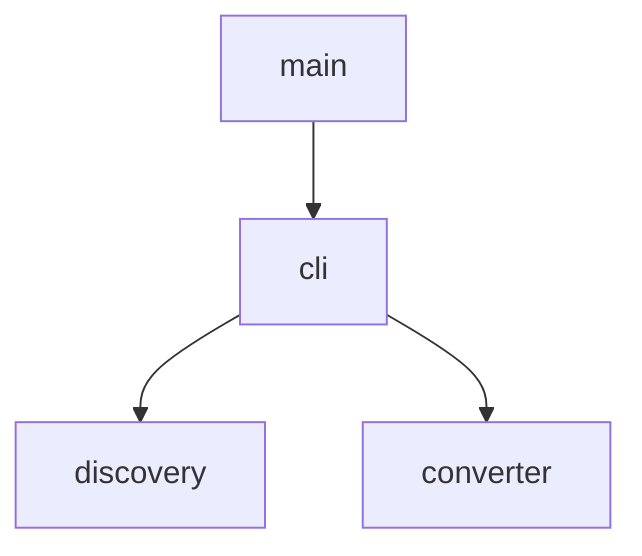

# PNG-to-PDF Converter — Implementation Plan

This plan breaks the low-level design into implementable tasks organized by execution batch. Tasks within a batch can be worked on according to their track assignments. All tasks in a batch must complete before committing and moving to the next batch.

**Total Tasks:** 10
**Batches:** 4
**Critical Path Length:** 7 tasks
**Max Parallel Tracks:** 2 (in Batches 1 and 2)

---

## Module Dependency Graph



Note: This is a single crate with modules, not separate packages. All modules share `Cargo.toml` and `src/`. However, `discovery` and `converter` are leaf modules with no dependency on each other, allowing parallel implementation.

---

## Batch Execution Overview

```
Batch 1: Project Scaffold + Leaf Modules
  Track A (serial): Task 1.1 → Task 1.2 → Task 1.3    [project setup, discovery]
  Track B (serial): Task 1.4 → Task 1.5                [converter]
  ─── Tracks A, B: CONFLICT (shared Cargo.toml, src/main.rs) ───
  >>> Commit checkpoint: Project compiles, discovery and converter unit tests pass

Batch 2: CLI + Wiring
  Track A (serial): Task 2.1 → Task 2.2                [cli module, main wiring]
  >>> Commit checkpoint: Full binary works end-to-end, unit tests pass

Batch 3: Integration Tests
  Track A (serial): Task 3.1 → Task 3.2                [test infrastructure, integration tests]
  >>> Commit checkpoint: All integration tests pass

Batch 4: Polish
  Track A (serial): Task 4.1                            [progress display, verbose mode]
  >>> Commit checkpoint: Feature-complete, all tests pass
```

---

## Batch 1: Project Scaffold + Leaf Modules

### Track A: Project Setup and Discovery Module

#### Task 1.1: Project Scaffold

**Prerequisites:** None
**Conflicts with:** Task 1.4 (shared `Cargo.toml`, `src/main.rs`)
**Parallel with:** None (do this first)
**Package:** root crate

**Objective:** Initialize the Cargo project with all dependencies and module declarations.

**Instructions:**
1. Run `cargo init` in the project root (or create `Cargo.toml` manually)
2. Add dependencies to `Cargo.toml`:
   - `pdf-writer` — PDF generation
   - `clap` with `derive` feature — CLI argument parsing
   - `rayon` — parallelism
   - `walkdir` — directory traversal
   - `indicatif` with `rayon` feature — progress bars
   - `anyhow` — error handling
3. Add dev-dependencies:
   - `tempfile` — temporary directories for tests
4. Create module structure in `src/`:
   - `src/main.rs` — minimal main that calls `cli::run`, placeholder modules declared
   - `src/cli.rs` — empty placeholder with `pub fn run`
   - `src/discovery.rs` — empty placeholder
   - `src/converter.rs` — empty placeholder
5. Ensure `cargo build` succeeds with placeholders

**Verification:**
- `cargo build` compiles without errors
- `cargo test` runs (no tests yet, but no failures)

**Requirements covered:** —

---

#### Task 1.2: Discovery Module

**Prerequisites:** Task 1.1
**Conflicts with:** Task 1.5 (both modify `src/main.rs` module declarations — minor, already declared in 1.1)
**Parallel with:** Task 1.4, Task 1.5 (after 1.1 is done)
**Package:** root crate, `src/discovery.rs`

**Objective:** Implement file discovery — recursive directory traversal with PNG filtering and output path mapping.

**Instructions:**
1. In `src/discovery.rs`, implement:
   - `ConversionJob` struct with fields: `input_path: PathBuf`, `output_path: PathBuf`, `relative_path: PathBuf`
   - `discover_jobs(input_dir: &Path, output_dir: &Path) -> anyhow::Result<Vec<ConversionJob>>`
2. Discovery logic:
   - Use `walkdir::WalkDir::new(input_dir)` for recursive traversal
   - Filter: skip hidden entries (name starts with `.`), skip non-files, match `.png` extension case-insensitively
   - For each matching file, compute `relative_path` by stripping `input_dir` prefix, then build `output_path` as `output_dir.join(relative_path).with_extension("pdf")`
   - Sort results by relative_path for deterministic output
3. Add unit tests in the same file (`#[cfg(test)] mod tests`):
   - `test_finds_png_files` — create temp dir with 2 PNGs, verify 2 jobs returned
   - `test_recursive_traversal` — nested dirs with PNGs
   - `test_case_insensitive_extension` — .PNG, .Png, .pNg all matched
   - `test_skips_non_png` — .jpg, .txt ignored
   - `test_skips_hidden_files` — `.hidden/file.png` and `.secret.png` excluded
   - `test_output_path_mapping` — verify output paths and .pdf extension
   - `test_empty_directory` — returns empty vec, no error
4. Reference: Low-Level Design §2.4, §8.1 (Discovery Module Tests)

**Verification:**
- `cargo test discovery` — all 7 tests pass

**Requirements covered:** FR-3.1.1, FR-3.1.2, FR-3.2.2

---

#### Task 1.3: Discovery Module — Input Validation

**Prerequisites:** Task 1.2
**Conflicts with:** None
**Parallel with:** Task 1.4, Task 1.5
**Package:** root crate, `src/discovery.rs`

**Objective:** Add input validation to discovery (non-existent dir, not-a-directory errors).

**Instructions:**
1. At the start of `discover_jobs`, validate:
   - `input_dir` exists → return `anyhow!("Input directory does not exist: {}")` if not
   - `input_dir` is a directory → return `anyhow!("Input path is not a directory: {}")` if not
2. Add unit tests:
   - `test_nonexistent_dir_returns_error` — path that doesn't exist
   - `test_file_as_input_returns_error` — regular file path as input_dir

**Verification:**
- `cargo test discovery` — all 9 tests pass

**Requirements covered:** FR-3.4.2

---

### Track B: Converter Module

#### Task 1.4: PNG Parser

**Prerequisites:** Task 1.1
**Conflicts with:** Task 1.2 (shared `Cargo.toml` already set up in 1.1 — minimal conflict)
**Parallel with:** Task 1.2, Task 1.3 (after 1.1 is done)
**Package:** root crate, `src/converter.rs`

**Objective:** Implement manual PNG chunk parsing — extract IHDR metadata and concatenate IDAT stream.

**Instructions:**
1. In `src/converter.rs`, define types:
   - `ColorType` enum: `Grayscale`, `Rgb`, `GrayscaleAlpha`, `Rgba`
   - `PngInfo` struct: `width: u32`, `height: u32`, `color_type: ColorType`, `bit_depth: u8`, `num_channels: u8`, `idat_data: Vec<u8>`
2. Implement `parse_png(data: &[u8]) -> anyhow::Result<PngInfo>`:
   - Validate 8-byte PNG signature: `[137, 80, 78, 71, 13, 10, 26, 10]`
   - Parse first chunk — must be IHDR (type bytes `b"IHDR"`, length 13):
     - Read width (4 bytes BE), height (4 bytes BE), bit_depth (1 byte), color_type (1 byte), compression (1 byte, must be 0), filter (1 byte, must be 0), interlace (1 byte)
     - Reject if interlace != 0 (return error: "Interlaced PNGs not supported")
     - Map color_type byte to ColorType enum: 0=Grayscale, 2=Rgb, 4=GrayscaleAlpha, 6=Rgba. Reject others.
     - Derive num_channels: Grayscale=1, Rgb=3, GrayscaleAlpha=2, Rgba=4
   - Skip IHDR CRC (4 bytes)
   - Iterate remaining chunks:
     - Read 4-byte length (BE u32), 4-byte type
     - If type == `b"IDAT"`: read `length` bytes, append to idat_data buffer
     - If type == `b"IEND"`: stop
     - Otherwise: skip `length` bytes (data) + 4 bytes (CRC)
     - For IDAT: also skip 4 bytes CRC after reading data
   - After loop: if idat_data is empty, return error "No IDAT chunks found"
   - Return PngInfo
3. Add unit tests:
   - `test_parses_valid_rgb_png` — use a minimal hand-crafted or programmatically-generated RGB PNG
   - `test_parses_rgba_png` — RGBA PNG
   - `test_parses_grayscale_png` — grayscale PNG
   - `test_concatenates_multiple_idat_chunks` — PNG with split IDAT
   - `test_rejects_interlaced_png` — interlace byte = 1
   - `test_rejects_invalid_png` — random bytes
   - `test_rejects_truncated_png` — valid header but truncated before IEND
   - `test_rejects_missing_idat` — valid IHDR + IEND but no IDAT
4. For test fixtures: create a helper function `make_minimal_png(width, height, color_type, idat_data, interlaced)` that constructs raw PNG bytes programmatically. This avoids binary fixtures.
5. Reference: Low-Level Design §2.5, §3.3, §8.1 (Converter Module Tests)

**Verification:**
- `cargo test converter::tests::test_parses` — all parser tests pass
- `cargo test converter::tests::test_rejects` — all rejection tests pass
- `cargo test converter::tests::test_concatenates` — multi-IDAT test passes

**Requirements covered:** FR-3.2.1, FR-3.4.1

---

#### Task 1.5: PDF Writer + convert_single

**Prerequisites:** Task 1.4
**Conflicts with:** Task 1.2 (minimal — different file `src/converter.rs` vs `src/discovery.rs`)
**Parallel with:** Task 1.2, Task 1.3
**Package:** root crate, `src/converter.rs`

**Objective:** Implement PDF generation from PngInfo and the convert_single orchestration function.

**Instructions:**
1. In `src/converter.rs`, implement `write_pdf(info: &PngInfo) -> Vec<u8>`:
   - Use `pdf_writer::Pdf::new()`
   - Create a page tree and single page with dimensions `(info.width as f32, info.height as f32)` in points
   - Create an image XObject:
     - Set width, height, bits_per_component from PngInfo
     - Set color_space: DeviceRgb for Rgb, DeviceGray for Grayscale, or DeviceRgb with SMask for RGBA/GrayscaleAlpha
     - Set filter to FlateDecode
     - Set decode_parms: Predictor 15 (PNG), Colors = num_channels (or base channels for alpha), BitsPerComponent = bit_depth, Columns = width
     - Stream body = `info.idat_data`
   - For RGBA/GrayscaleAlpha: this is a stretch goal. For v1, if alpha channel present, handle by noting it in DecodeParms or by treating as RGB (acceptable quality tradeoff). Document the decision.
   - Reference the image XObject from the page's content stream (draw at full page size)
   - Return `pdf.finish()` bytes
2. Define `Outcome` enum: `Success`, `Skipped`, `Failed { error_message: String }`
3. Define `ConversionResult` struct: `relative_path: PathBuf`, `outcome: Outcome`
4. Implement `convert_single(job: &ConversionJob, no_overwrite: bool) -> ConversionResult`:
   - If `no_overwrite` and `job.output_path.exists()`: return Skipped
   - Read file bytes with `std::fs::read(&job.input_path)` — on error, return Failed
   - Call `parse_png(&bytes)` — on error, return Failed
   - Call `write_pdf(&info)` to get PDF bytes
   - Create parent dirs: `std::fs::create_dir_all(job.output_path.parent())` — on error, return Failed
   - Write PDF: `std::fs::write(&job.output_path, &pdf_bytes)` — on error, return Failed
   - Return Success
5. Add unit tests:
   - `test_produces_valid_pdf` — call write_pdf, check output starts with `%PDF-`
   - `test_page_dimensions_match` — parse PDF output to verify page MediaBox matches width x height
   - `test_creates_output_directories` — convert_single with non-existent parent dirs
   - `test_skips_existing_when_no_overwrite` — existing file + no_overwrite=true → Skipped
   - `test_overwrites_existing_by_default` — existing file + no_overwrite=false → Success, file updated
   - `test_returns_failed_on_bad_input` — corrupt file → Failed, no panic
6. Reference: Low-Level Design §2.5, §4.2, §4.3, §8.1 (Converter Module Tests)

**Verification:**
- `cargo test converter` — all converter tests pass (parser + pdf writer + convert_single)

**Requirements covered:** FR-3.2.1, FR-3.2.2, FR-3.4.1, FR-3.4.3

---

### Batch 1 Commit Checkpoint

After all tracks complete:
- [ ] Project compiles: `cargo build`
- [ ] All tests pass: `cargo test`
- [ ] Available for next batch: `ConversionJob`, `discover_jobs`, `parse_png`, `write_pdf`, `convert_single`, `ConversionResult`, `Outcome`, `PngInfo` all implemented and tested

---

## Batch 2: CLI + Wiring

### Track A: CLI Module and Main Entry Point

#### Task 2.1: CLI Args and run() Orchestration

**Prerequisites:** Task 1.2, Task 1.3, Task 1.5
**Conflicts with:** None
**Parallel with:** None
**Package:** root crate, `src/cli.rs`

**Objective:** Implement clap Args struct and the `run()` function that orchestrates discovery → conversion → summary.

**Instructions:**
1. In `src/cli.rs`, define `Args` with clap derive:
   - `input_dir: PathBuf` — positional argument
   - `output_dir: PathBuf` — positional argument
   - `--dry-run` / `-n`: bool
   - `--verbose` / `-v`: bool
   - `--jobs` / `-j`: `Option<usize>`
   - `--no-overwrite`: bool
2. Define `BatchSummary` struct: `total: usize`, `succeeded: usize`, `failed: usize`, `skipped: usize`, `elapsed: Duration`, `failures: Vec<ConversionResult>`
3. Implement `convert_batch(jobs: &[ConversionJob], no_overwrite: bool, num_threads: Option<usize>) -> BatchSummary`:
   - If `num_threads` is Some, build a custom rayon ThreadPool with that count; otherwise use global pool
   - Use `rayon::iter::IntoParallelRefIterator` on jobs
   - Map each job through `convert_single(job, no_overwrite)`
   - Collect results, compute summary counts
   - Record elapsed time with `Instant::now()` before/after
4. Implement `pub fn run(args: Args) -> anyhow::Result<i32>` (returns exit code):
   - Call `discover_jobs(&args.input_dir, &args.output_dir)?` (fatal on error)
   - If no files found: print message, return Ok(0)
   - Print count: `"Found {n} PNG files"`
   - If `args.dry_run`: list files and return Ok(0)
   - Create output dir: `std::fs::create_dir_all(&args.output_dir)?`
   - Call `convert_batch(&jobs, args.no_overwrite, args.jobs)`
   - Print summary: `"Converted {succeeded}/{total} files ({failed} failed, {skipped} skipped) in {elapsed:.1}s"`
   - If any failures and verbose: print each failure's path and error
   - Return Ok(0) if no failures, Ok(1) otherwise
5. Update `src/main.rs`:
   - Parse args: `let args = Args::parse();`
   - Call `cli::run(args)`, handle result, call `std::process::exit(code)`
6. Add unit tests for Args parsing and run() logic:
   - `test_required_args` — verify clap fails without positional args
   - `test_all_flags_parse` — all flags parse correctly
   - `test_dry_run_no_output_files` — dry run lists files, creates no PDFs
   - `test_exit_code_zero_on_success` — all valid files → 0
   - `test_exit_code_one_on_any_failure` — mix of valid + invalid → 1
   - `test_creates_output_dir` — non-existent output dir created
7. Reference: Low-Level Design §2.3, §3.1, §4.1, §7, §8.1 (CLI Module Tests)

**Verification:**
- `cargo test cli` — all CLI tests pass
- `cargo run -- /tmp/some-test-dir /tmp/output-dir` — binary runs end-to-end

**Requirements covered:** FR-3.3.1, FR-3.3.2, FR-3.3.3, FR-3.4.1, FR-3.4.2, NFR-4.1

---

#### Task 2.2: End-to-End Smoke Test

**Prerequisites:** Task 2.1
**Conflicts with:** None
**Parallel with:** None
**Package:** root crate

**Objective:** Verify the full binary works end-to-end with a real PNG file, producing a valid PDF.

**Instructions:**
1. Create a minimal integration test in `tests/smoke.rs`:
   - Create a temp dir with one programmatically-generated PNG (use the same helper from converter tests)
   - Run `cli::run(Args { input_dir, output_dir, dry_run: false, verbose: false, jobs: None, no_overwrite: false })`
   - Assert: exit code 0, output PDF exists, starts with `%PDF-`
2. This is a fast confidence check before the full integration test suite in Batch 3

**Verification:**
- `cargo test --test smoke` — passes

**Requirements covered:** FR-3.2.1 (end-to-end)

---

### Batch 2 Commit Checkpoint

After all tracks complete:
- [ ] Project compiles: `cargo build`
- [ ] All unit tests pass: `cargo test`
- [ ] Binary works: `cargo run -- <input> <output>` produces PDFs
- [ ] Smoke test passes: `cargo test --test smoke`

---

## Batch 3: Integration Tests

### Track A: Full Integration Test Suite

#### Task 3.1: Test Helpers and Fixtures

**Prerequisites:** Task 2.2
**Conflicts with:** Task 3.2 (shared `tests/` directory)
**Parallel with:** None
**Package:** root crate, `tests/helpers/`

**Objective:** Create shared test utilities for integration tests — PNG generation helpers and PDF validation helpers.

**Instructions:**
1. Create `tests/common/mod.rs` (or `tests/helpers.rs` included by test files):
   - `make_png(width: u32, height: u32, color_type: u8, data: &[u8]) -> Vec<u8>` — builds a minimal valid PNG with given IDAT data (use zlib-compressed dummy scanlines)
   - `make_rgb_png(width: u32, height: u32) -> Vec<u8>` — convenience for RGB with solid color
   - `make_rgba_png(width: u32, height: u32) -> Vec<u8>` — convenience for RGBA
   - `make_grayscale_png(width: u32, height: u32) -> Vec<u8>` — convenience for grayscale
   - `assert_valid_pdf(data: &[u8])` — checks %PDF- header, checks %%EOF trailer
   - `setup_test_dir(files: &[(&str, &[u8])]) -> TempDir` — creates a temp dir with given file paths and contents
2. Add `flate2` as a dev-dependency for generating valid zlib-compressed IDAT data in test helpers

**Verification:**
- `cargo test --test smoke` still passes (no regressions)
- Helper functions compile

**Requirements covered:** — (infrastructure)

---

#### Task 3.2: Integration Tests

**Prerequisites:** Task 3.1
**Conflicts with:** None
**Parallel with:** None
**Package:** root crate, `tests/integration.rs`

**Objective:** Implement the full integration test suite from the low-level design.

**Instructions:**
1. Create `tests/integration.rs` using helpers from Task 3.1:
   - `test_full_pipeline_small_batch`:
     - Setup: 3 PNGs (RGB, RGBA, grayscale) in flat temp dir
     - Exercise: `cli::run` with input/output dirs
     - Assert: 3 PDFs created, each valid, exit code 0
   - `test_full_pipeline_nested_dirs`:
     - Setup: PNGs at `a.png`, `sub/b.png`, `sub/deep/c.png`
     - Assert: output mirrors structure exactly
   - `test_full_pipeline_mixed_files`:
     - Setup: 2 PNGs + `file.jpg` + `notes.txt` + `.hidden.png`
     - Assert: only 2 PDFs created
   - `test_full_pipeline_with_failures`:
     - Setup: 2 valid PNGs + 1 file named `.png` with garbage content
     - Assert: 2 succeed, 1 fails, exit code 1
   - `test_large_image_dimensions`:
     - Setup: create a 10000x5000 minimal PNG
     - Assert: PDF page dimensions are 10000x5000 points (parse MediaBox from PDF bytes)
   - `test_output_pdf_opens_correctly`:
     - Setup: convert a known test PNG
     - Assert: PDF contains XObject with Filter FlateDecode and DecodeParms with Predictor 15
2. Reference: Low-Level Design §8.2

**Verification:**
- `cargo test --test integration` — all 6 integration tests pass

**Requirements covered:** FR-3.1.1, FR-3.1.2, FR-3.2.1, FR-3.2.2, FR-3.3.3, FR-3.4.1

---

### Batch 3 Commit Checkpoint

After all tracks complete:
- [ ] Full build passes: `cargo build`
- [ ] All unit tests pass: `cargo test --lib`
- [ ] All integration tests pass: `cargo test --tests`
- [ ] Full suite: `cargo test` — all green

---

## Batch 4: Polish

### Track A: Progress Display

#### Task 4.1: Progress Bar and Verbose Output

**Prerequisites:** Task 3.2
**Conflicts with:** None
**Parallel with:** None
**Package:** root crate, `src/cli.rs`

**Objective:** Add indicatif progress bar during conversion and verbose per-file output.

**Instructions:**
1. In `cli::run`, after discovery and before `convert_batch`:
   - Create an `indicatif::ProgressBar` with length = job count
   - Style it: `[{bar:40}] {pos}/{len} ({eta})` or similar
2. Modify `convert_batch` to accept a `&ProgressBar` and call `pb.inc(1)` after each file completes
   - Use `rayon`'s parallel iterator with `.inspect(|_| pb.inc(1))`
3. In verbose mode (`args.verbose`):
   - After each conversion, print the relative path and outcome to stderr
   - Use `pb.println()` to print without corrupting the progress bar
4. When `--dry-run`: no progress bar, just list file paths to stdout
5. At end: `pb.finish_and_clear()` before printing summary
6. Update existing tests if progress bar changes function signatures (add `&ProgressBar` parameter or make it optional via `Option<&ProgressBar>`)

**Verification:**
- `cargo test` — all tests still pass
- Manual test: `cargo run -- /Users/slava/data/hvac/images /tmp/hvac-output` shows progress bar
- Manual test: `cargo run -- -v /Users/slava/data/hvac/images /tmp/hvac-output` shows per-file output

**Requirements covered:** FR-3.3.3

---

### Batch 4 Commit Checkpoint

After all tracks complete:
- [ ] Full build passes: `cargo build --release`
- [ ] All tests pass: `cargo test`
- [ ] Manual verification: convert real HVAC files successfully
- [ ] Feature complete per requirements

---

## Task Status Tracker

This table is the single source of truth for task progress. Update status here as tasks are worked on.

**Status values:** `[ ]` Not started | `[~]` In progress | `[x]` Completed

| Task | Description | Prerequisites | Conflicts | Status |
|------|-------------|---------------|-----------|--------|
| 1.1 | Project scaffold | None | 1.4 (Cargo.toml) | [x] |
| 1.2 | Discovery module | 1.1 | — | [x] |
| 1.3 | Discovery input validation | 1.2 | — | [x] |
| 1.4 | PNG parser | 1.1 | 1.2 (Cargo.toml) | [x] |
| 1.5 | PDF writer + convert_single | 1.4 | — | [x] |
| 2.1 | CLI args + run() orchestration | 1.3, 1.5 | — | [ ] |
| 2.2 | End-to-end smoke test | 2.1 | — | [ ] |
| 3.1 | Test helpers and fixtures | 2.2 | 3.2 (tests/) | [ ] |
| 3.2 | Integration tests | 3.1 | — | [ ] |
| 4.1 | Progress bar + verbose output | 3.2 | — | [ ] |

**Eligible tasks** (status `[ ]`, all prerequisites `[x]`, no conflicting task `[~]`):
- Task 2.1: CLI args + run() orchestration

**Progress:** 5 / 10 tasks complete

---

## Critical Path

The longest sequential chain determines the minimum completion time regardless of parallelism:

```
Task 1.1 → Task 1.4 → Task 1.5 → Task 2.1 → Task 2.2 → Task 3.1 → Task 3.2 → Task 4.1
  [scaffold]  [png parser]  [pdf writer]  [cli+wiring]  [smoke]   [helpers]  [integration]  [polish]
```

**Critical path length:** 8 tasks (through converter track)

The discovery track (1.1 → 1.2 → 1.3) is shorter at 3 tasks and can run in parallel after 1.1.

---

## Parallelization Summary

| Batch | Tracks | Parallel? | Conflicts | Commit Coordination |
|-------|--------|-----------|-----------|-------------------|
| 1 | A (discovery), B (converter) | Soft parallel after 1.1 | Shared Cargo.toml (set up in 1.1) | Both tracks must complete before commit |
| 2 | A only | Serial | — | Straightforward commit |
| 3 | A only | Serial (3.1 → 3.2) | — | Straightforward commit |
| 4 | A only | Serial | — | Straightforward commit |

**Theoretical speedup:** With 2 parallel agents after Task 1.1, Batch 1's Track A (Tasks 1.2, 1.3) and Track B (Tasks 1.4, 1.5) can overlap, saving ~2 task durations. Remaining batches are serial. Practical speedup: ~1.3x.

**Recommendation:** Given the single-crate structure, serial execution (one task at a time) is simpler and avoids merge conflicts. Parallelism benefit is marginal for 10 tasks.

---

## Requirements Traceability

| Requirement | Implementation Task(s) | Unit Test Task(s) | Integration Test Task(s) |
|-------------|----------------------|-------------------|--------------------------|
| FR-3.1.1 | 1.2 | 1.2 | 3.2 |
| FR-3.1.2 | 1.2 | 1.2 | 3.2 |
| FR-3.2.1 | 1.4, 1.5 | 1.4, 1.5 | 3.2 |
| FR-3.2.2 | 1.2, 1.5 | 1.2, 1.5 | 3.2 |
| FR-3.3.1 | 2.1 | 2.1 | — |
| FR-3.3.2 | 2.1, 4.1 | 2.1 | — |
| FR-3.3.3 | 2.1, 4.1 | — | 3.2 |
| FR-3.4.1 | 1.4, 1.5, 2.1 | 1.4, 1.5, 2.1 | 3.2 |
| FR-3.4.2 | 1.3, 2.1 | 1.3, 2.1 | — |
| FR-3.4.3 | 1.5 | 1.5 | — |
| NFR-4.1 | 2.1 | 2.1 | — |

---

## Plan Summary

| Batch | Tasks | Tracks | Theme |
|-------|-------|--------|-------|
| 1 | 5 | 2 | Project scaffold + leaf modules (discovery, converter) |
| 2 | 2 | 1 | CLI wiring + smoke test |
| 3 | 2 | 1 | Integration test suite |
| 4 | 1 | 1 | Progress display polish |
| **Total** | **10** | | |
