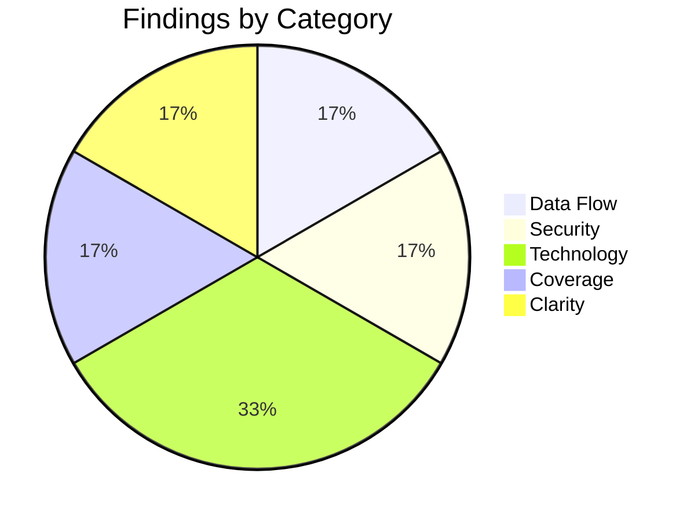

# High-Level Design Review: PNG-to-PDF Converter

**Document Reviewed:** `design/converter-high-level-design.md`
**Requirements Reference:** `design/converter-requirements.md`
**Review Date:** 2026-06-26
**Reviewer:** Claude (Automated Review)

---

## Executive Summary

The high-level design for a local Rust CLI PNG-to-PDF converter is well-matched to the simplicity of the problem. The architecture is appropriately minimal — three components with clear responsibilities, sound technology choices, and no over-engineering. The most significant finding is that the decision to parse PNG headers manually (bypassing the `png` crate) introduces risk around malformed files without a clear fallback specified.

**Overall Verdict:** Ready for low-level design (with one targeted fix recommended)

---

## Section Verdicts

| Review Area | Verdict | Findings |
|-------------|---------|----------|
| Architecture & Component Design | Sufficient | 0 |
| Data Model Soundness | Sufficient | 0 |
| Data Flow Integrity | Sufficient | 1 |
| Security Architecture | Sufficient | 1 |
| Technology Choices | Partially Addressed | 2 |
| Deployment & Operational Readiness | Sufficient | 0 |
| Requirements Coverage | Sufficient | 1 |
| Specification Clarity | Sufficient | 1 |

---

## 1. Architecture & Component Design

### Current State

Three components (CLI Entry Point, File Discovery, Conversion Engine) with clear ownership boundaries. Communication is simple: discovery produces a list, conversion consumes it in parallel, CLI orchestrates and reports.

### Strengths

- Component decomposition matches the problem exactly — not over-decomposed for a batch CLI tool
- Clear ownership: discovery owns traversal logic, conversion owns PDF construction, CLI owns orchestration
- No circular dependencies
- Single process, no IPC, no coordination complexity

### Gaps and Recommendations

No gaps identified. The architecture is appropriately simple for a local batch tool.

### Verdict: **Sufficient**

---

## 2. Data Model Soundness

### Current State

Three in-memory structures (ConversionJob, ConversionResult, BatchSummary) with no persistent state. This is correct for a stateless batch tool.

### Strengths

- No unnecessary data modeling — correctly identifies that there's no persistent state
- ConversionResult captures what's needed for error reporting and summary generation
- Data lifecycle explicitly addressed ("one-way, no caching, no state between runs")

### Gaps and Recommendations

No gaps identified. The data model is minimal and correct.

### Verdict: **Sufficient**

---

## 3. Data Flow Integrity

### Current State

Both the pipeline flow (discovery → parallel conversion → summary) and single-file conversion flow are documented. Failure paths are addressed.

### Strengths

- Happy path clearly specified with sequence diagram
- Failure paths enumerated (single file error, write error, missing input dir, all-fail case)
- Clear that batch continues on individual failure

### Gaps and Recommendations

| ID | Gap | Flow | Priority | Recommendation |
|----|-----|------|----------|----------------|
| FLOW-1 | Disk-full mid-batch behavior not specified | Single file conversion | Consider | Design SHOULD specify behavior when disk fills during batch (e.g., stop early vs. continue attempting and failing each file). Continuing to attempt writes after a disk-full error wastes time. |

### Verdict: **Sufficient**

---

## 4. Security Architecture

### Current State

| Aspect | Status | Notes |
|--------|--------|-------|
| Authentication | N/A | Local-only tool, no auth needed |
| Authorization | N/A | Runs as invoking user |
| Trust Boundaries | Defined | Filesystem is the only boundary |
| Encryption in Transit | N/A | No network access |
| Encryption at Rest | N/A | No sensitive data |
| Secrets Management | N/A | No secrets |
| Input Validation | Partial | PNG header validation mentioned but depth unclear |

### Gaps and Recommendations

| ID | Gap | Priority | Recommendation |
|----|-----|----------|----------------|
| SEC-1 | PNG header validation depth is underspecified | Consider | Design states "magic bytes + IHDR chunk integrity" but doesn't specify what happens with adversarial/malformed IHDR (e.g., claimed dimensions of 2^31 x 2^31). The low-level design SHOULD specify maximum dimension bounds to avoid allocating absurd page sizes. |

### Verdict: **Sufficient**

---

## 5. Technology Choices

### Assessment

| Technology | Choice | Rationale Provided? | Alternatives Considered? | Concerns |
|------------|--------|---------------------|--------------------------|----------|
| Language | Rust | Yes | No (user requirement) | None |
| PDF Generation | pdf-writer | Yes | Yes (printpdf, lopdf) | None |
| Parallelism | rayon | Yes | Yes (tokio, std::thread) | None |
| CLI Parsing | clap | Yes | No | None — de facto standard |
| Directory Walking | walkdir | Yes | No | None — de facto standard |
| PNG Header | Manual parsing | Yes | Yes (image, png crate) | See TECH-1 |
| Progress | indicatif | Yes | No | None |
| Error Handling | anyhow | Yes | No | None |

### Gaps and Recommendations

| ID | Gap | Priority | Recommendation |
|----|-----|----------|----------------|
| TECH-1 | Manual PNG header parsing introduces fragility risk | Should Address | While avoiding the full `image` crate is sound, the `png` crate (lightweight, pure-Rust, widely used) handles IHDR parsing with proper validation for edge cases (interlaced PNGs, non-standard bit depths, CRC verification). Manual parsing of 33 bytes saves one dependency but gains responsibility for handling malformed chunks. Design SHOULD reconsider using the `png` crate in header-only mode (`png::Decoder` with `read_info()`) as a middle ground. |
| TECH-2 | pdf-writer's ability to embed raw PNG streams should be verified | Consider | The design assumes pdf-writer can embed a raw PNG stream and have PDF viewers decode it natively. This is correct (PDF spec supports DCTDecode for JPEG and raw streams for PNG via FlateDecode with PNG predictors), but the specific pdf-writer API for this should be confirmed during low-level design. If pdf-writer requires manual filter/predictor setup, document the approach. |

### Verdict: **Partially Addressed**

---

## 6. Deployment & Operational Readiness

### Current State

Single binary, `cargo build --release`, no infrastructure. Local development is just `cargo run`. This is appropriate.

### Strengths

- Deployment model matches the tool's nature — no over-engineering
- Disk space estimate provided (1:1 ratio)
- RAM usage characterized (N files x file size)
- No Docker, no config files, no external dependencies at runtime

### Gaps and Recommendations

No gaps identified. Operational readiness is inherently simple for a local CLI tool.

### Verdict: **Sufficient**

---

## 7. Requirements Coverage

### Coverage Matrix

| Requirement | Addressed In Design? | Section | Notes |
|-------------|---------------------|---------|-------|
| FR-3.1.1 Recursive traversal | Yes | 3.2 File Discovery | walkdir handles this |
| FR-3.1.2 File filtering | Yes | 3.2 File Discovery | Case-insensitive, skip hidden |
| FR-3.2.1 PNG to PDF conversion | Yes | 3.3 Conversion Engine | pdf-writer with raw embedding |
| FR-3.2.2 Directory structure preservation | Yes | 3.2 File Discovery (Path Mapper) | |
| FR-3.3.1 Required arguments | Yes | 3.1 CLI Entry Point | clap handles this |
| FR-3.3.2 Behavior options | Partial | 3.1 CLI Entry Point | See COV-1 |
| FR-3.3.3 Progress reporting | Yes | 3.1 CLI Entry Point | indicatif |
| FR-3.4.1 Graceful failure | Yes | 5.3 Failure Paths | |
| FR-3.4.2 Input validation | Yes | 5.3 Failure Paths | |
| FR-3.4.3 Conflict handling | Yes | Implicit | Overwrite by default |
| NFR-4.1 Performance | Yes | 3.3 Conversion Engine | rayon parallelism |
| NFR-4.2 Binary distribution | Yes | 8. Deployment Model | |
| NFR-4.3 Dependencies | Yes | 9. Technology Choices | All pure-Rust |

### Gaps

| ID | Requirement | Status | Recommendation |
|----|-------------|--------|----------------|
| COV-1 | FR-3.3.2 `--jobs` flag for parallelism control | Partial | The design mentions rayon defaults to all cores but doesn't architecturally address the `--jobs` flag. This is minor — rayon supports `ThreadPoolBuilder::num_threads()` — but it should be noted as a CLI parameter that configures the conversion engine. |

### Verdict: **Sufficient**

---

## 8. Specification Clarity

### Items Requiring Clarification

| ID | Item | Section | Issue | Question |
|----|------|---------|-------|----------|
| UNCLEAR-1 | "1 pixel = 1 point" dimension mapping | 5.2 Single File Conversion | Potentially ambiguous | A PDF point is 1/72 inch. A 3000x4000 PNG at 1px=1pt would produce a 41.7" x 55.6" page. Is this the intended behavior, or should DPI metadata from the PNG's pHYs chunk be respected when present? For scanned documents this matters — a 300 DPI scan at 2550x3300 pixels should arguably produce an 8.5"x11" page, not a 35"x46" page. |

### Verdict: **Sufficient**

---

## Summary of Recommendations

### Must Address (Blocking — resolve before low-level design)

None.

### Should Address (High Priority)

1. **TECH-1:** Reconsider manual PNG header parsing — use the `png` crate's header-only mode for robust IHDR validation without the weight of the full `image` crate.

### Consider (Medium Priority)

1. **UNCLEAR-1:** Clarify pixel-to-point mapping strategy — decide whether to respect PNG DPI metadata (pHYs chunk) when present, or always use 1px=1pt regardless.
2. **TECH-2:** Verify pdf-writer's raw PNG stream embedding API during low-level design.
3. **FLOW-1:** Specify disk-full behavior (early stop vs. continue-and-fail).
4. **SEC-1:** Define maximum dimension bounds to prevent absurd page sizes from malformed PNGs.
5. **COV-1:** Note `--jobs` flag as a CLI parameter that configures rayon's thread count.

---

## Findings Summary

| Area | Verdict | Must | Should | Consider |
|------|---------|------|--------|----------|
| Architecture & Components | Sufficient | 0 | 0 | 0 |
| Data Model | Sufficient | 0 | 0 | 0 |
| Data Flows | Sufficient | 0 | 0 | 1 |
| Security | Sufficient | 0 | 0 | 1 |
| Technology Choices | Partially Addressed | 0 | 1 | 1 |
| Deployment & Ops | Sufficient | 0 | 0 | 0 |
| Requirements Coverage | Sufficient | 0 | 0 | 1 |
| Specification Clarity | Sufficient | 0 | 0 | 1 |
| **Total** | | **0** | **1** | **5** |
