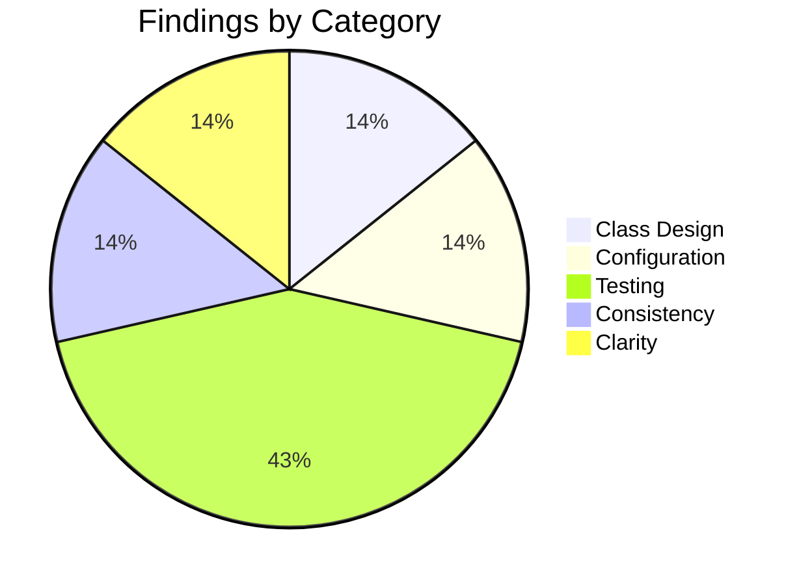

# Low-Level Design Review: PNG-to-PDF Converter

**Document Reviewed:** `design/converter-low-level-design.md`
**Requirements Reference:** `design/converter-requirements.md`
**High-Level Design Reference:** `design/converter-high-level-design.md`
**Review Date:** 2026-06-26
**Reviewer:** Claude (Automated Review)

---

## Executive Summary

The low-level design is well-structured for a tool of this scope — four modules with clear responsibilities, appropriate use of Rust's type system, and a comprehensive testing strategy. The most significant finding is that the `png` crate's standard API does not expose raw IDAT chunks directly — the design assumes an extraction method that will require using the crate's lower-level `StreamingDecoder` or manual chunk iteration, and this approach should be explicitly specified.

**Overall Verdict:** Ready for implementation (with one targeted clarification recommended)

---

## Section Verdicts

| Review Area | Verdict | Findings |
|-------------|---------|----------|
| Package/Module Structure | Sufficient | 0 |
| Class/Type Design | Sufficient | 1 |
| Class Interactions & Workflows | Sufficient | 0 |
| Data Access Layer | Sufficient | 0 |
| Error Handling | Sufficient | 0 |
| Configuration & Wiring | Sufficient | 1 |
| Testing Completeness | Partially Addressed | 2 |
| Consistency with High-Level Design | Sufficient | 1 |
| Specification Clarity | Partially Addressed | 1 |

---

## 1. Package/Module Structure

### Current State

Four modules: `main` (entry), `cli` (args + orchestration), `discovery` (file finding), `converter` (PNG parsing + PDF writing). Dependencies flow downward from main/cli to discovery and converter, with no circular deps.

### Strengths

- Correct granularity — not over-decomposed for a focused CLI tool
- No circular dependencies
- Each module is independently testable
- `converter` has no dependency on `cli` or `discovery` — pure transformation logic

### Gaps and Recommendations

No gaps identified. The module structure is appropriately minimal.

### Verdict: **Sufficient**

---

## 2. Class/Type Design

### Current State

Six key types: `Args` (CLI config), `ConversionJob` (work unit), `PngInfo` (parsed PNG data), `ConversionResult` (per-file outcome), `Outcome` (success/fail/skip enum), `BatchSummary` (aggregated stats). Uses Rust enums for sum types (Outcome, ColorType).

### Strengths

- `Outcome` as an enum with variants is idiomatic Rust — exhaustive matching prevents missed cases
- `PngInfo` cleanly separates parsing concern from PDF writing concern
- `ConversionResult` always produced (never panics) — correct for rayon safety
- No unnecessary traits or generics — direct concrete types throughout

### Gaps and Recommendations

| ID | Gap | Class/Type | Priority | Recommendation |
|----|-----|------------|----------|----------------|
| CLASS-1 | `PngInfo.idat_data` is described as `Vec<u8>` but the nature of this data is ambiguous | `PngInfo` | Should Address | Clarify: is `idat_data` the raw concatenated IDAT chunk payloads (zlib-wrapped), or the unwrapped deflate stream? The PDF FlateDecode filter expects a zlib stream (header + deflate + checksum). PNG IDAT chunks contain zlib-compressed data. The design SHOULD specify that `idat_data` is the concatenated raw IDAT payloads (which ARE zlib-wrapped and can be passed directly to FlateDecode). |

### Verdict: **Sufficient**

---

## 3. Class Interactions & Workflows

### Current State

Two sequence diagrams (full pipeline and single-file conversion) plus an error propagation flowchart. The full pipeline covers the end-to-end flow; single-file covers the internal converter logic.

### Strengths

- Error propagation is explicitly diagrammed — every failure point identified
- Clear ownership: `convert_single` catches all errors and wraps in `ConversionResult`
- The sequence diagrams match the module dependency graph exactly

### Gaps and Recommendations

No gaps identified. All requirements-relevant workflows are covered.

### Missing Workflow Coverage

| Requirement | Workflow Documented? | Notes |
|-------------|---------------------|-------|
| FR-3.1.1 | Yes | Full pipeline diagram |
| FR-3.2.1 | Yes | Single file conversion diagram |
| FR-3.3.2 (dry-run) | No | Trivial — short-circuits before conversion, not worth a diagram |
| FR-3.4.1 | Yes | Error propagation flowchart |

### Verdict: **Sufficient**

---

## 4. Data Access Layer

### Current State

Filesystem-only access using `std::fs::read` (full file), `std::fs::write` (atomic), `create_dir_all`, and `Path::exists`. Appropriate for a batch file-processing tool.

### Strengths

- Correctly identified that full-file reads are appropriate for 1-6 MB files
- Atomic write strategy (build in memory, flush once) prevents partial PDFs
- `create_dir_all` is idempotent — safe for parallel execution on overlapping directory trees

### Gaps and Recommendations

No gaps identified.

### Verdict: **Sufficient**

---

## 5. Error Handling

### Current State

Two-tier approach: `anyhow::Result` for fatal errors (input validation), infallible `ConversionResult` for per-file outcomes. Clean separation between "stop everything" errors and "log and continue" errors.

### Strengths

- `convert_single` never returns `Result` — guarantees rayon safety
- Fatal vs. recoverable errors clearly distinguished
- Exit code semantics well-defined (0 = all success, 1 = any failure)
- `anyhow` context is appropriate for a CLI tool (readable error chains for the user)

### Gaps and Recommendations

No gaps identified. The error strategy is sound for a batch CLI tool.

### Verdict: **Sufficient**

---

## 6. Configuration & Wiring

### Current State

Direct function calls with no DI framework. Startup sequence: parse args → validate → optionally configure rayon pool → run pipeline. All configuration from CLI flags.

### Strengths

- No unnecessary abstraction — direct wiring is correct for this tool's complexity
- rayon ThreadPoolBuilder placement is correct (before batch, not per-file)
- All config parameters typed and validated by clap at parse time

### Gaps and Recommendations

| ID | Gap | Priority | Recommendation |
|----|-----|----------|----------------|
| CONF-1 | Rayon pool configuration timing | Consider | The design states `cli::run` configures rayon if `--jobs` is specified, but `rayon::ThreadPoolBuilder::build_global()` must be called before any rayon operations. The design SHOULD specify that this is called at the start of `run()` before `convert_batch`, and that calling `build_global` after rayon has already been used (e.g., in discovery if it ever uses par_iter) panics. This is already implied but should be explicit. |

### Verdict: **Sufficient**

---

## 7. Testing Completeness

This is the most critical section of the low-level design review.

### 7.1 Unit Test Assessment

| ID | Gap | Class | Requirement | Priority | Recommendation |
|----|-----|-------|-------------|----------|----------------|
| TEST-1 | No test for multi-IDAT-chunk PNG | `parse_png` | FR-3.2.1 | Should Address | Large PNGs split compressed data across multiple IDAT chunks. The test suite SHOULD include a fixture with multiple IDAT chunks to verify correct concatenation. This can be created programmatically by encoding a PNG with a small chunk size. |
| TEST-2 | No test for the `--no-overwrite` integration path | `convert_batch` | FR-3.4.3 | Consider | The `--no-overwrite` flag is unit-tested on `convert_single` but should also have a batch-level test verifying the `Skipped` count in `BatchSummary`. |

### 7.2 Integration Test Assessment

| ID | Gap | Requirement | Priority | Recommendation |
|----|-----|-------------|----------|----------------|
| TEST-3 | No integration test for `--verbose` output content | FR-3.3.2 | Consider | The design specifies verbose mode but no test verifies its output. A test SHOULD at minimum confirm that stderr/stdout contains per-file lines when `-v` is passed. |

### 7.3 Requirements Traceability Gaps

All requirements have at least minimal coverage. Minor gaps:

| Requirement | Unit Tests? | Integration Tests? | Gap | Recommendation |
|-------------|-------------|-------------------|-----|----------------|
| FR-3.3.3 | No | Partial | Summary output format not verified | Consider: assert summary line matches expected pattern |

### 7.4 Test Infrastructure Assessment

No gaps. The use of `tempfile::TempDir` and small fixture PNGs is appropriate and sufficient.

### Verdict: **Partially Addressed**

---

## 8. Consistency with High-Level Design

### Alignment Check

| High-Level Element | Low-Level Correspondence | Status | Notes |
|-------------------|-------------------------|--------|-------|
| CLI Entry Point component | `cli` module | Aligned | |
| File Discovery component | `discovery` module | Aligned | |
| Conversion Engine component | `converter` module | Aligned | |
| PNG Parser subcomponent | `parse_png` function in converter | Aligned | |
| PDF Writer subcomponent | `write_pdf` function in converter | Aligned | |
| Parallel Executor subcomponent | `convert_batch` using rayon | Aligned | |
| ConversionJob data structure | `ConversionJob` struct | Aligned | |
| ConversionResult data structure | `ConversionResult` + `Outcome` enum | Aligned | |
| BatchSummary data structure | `BatchSummary` struct | Aligned | |
| Technology: pdf-writer | Used in `write_pdf` | Aligned | |
| Technology: png crate | Used in `parse_png` | Aligned | |
| Technology: rayon | Used in `convert_batch` | Aligned | |
| Technology: clap | Used in `Args` | Aligned | |
| Technology: walkdir | Used in `discover_jobs` | Aligned | |
| Technology: indicatif | Used in progress reporting | Aligned | |

### Gaps and Recommendations

| ID | Gap | Priority | Recommendation |
|----|-----|----------|----------------|
| CONSIST-1 | High-level design mentions `anyhow` for error handling but low-level design doesn't specify where `anyhow::Context` is applied | Consider | Minor — the implementer can figure this out, but explicitly noting that `anyhow::Context` wraps IO errors in discovery and that `convert_single` uses plain string errors in Outcome::Failed would help. |

### Verdict: **Sufficient**

---

## 9. Specification Clarity

### Items Requiring Clarification

| ID | Item | Section | Issue | Question |
|----|------|---------|-------|----------|
| UNCLEAR-1 | IDAT extraction method | Section 3.3, converter module | Undefined | The `png` crate's high-level `Decoder` API decodes pixels — it does NOT expose raw IDAT chunks. To get raw compressed data, the implementer must either: (a) use `png::StreamingDecoder` at the chunk level, (b) manually parse PNG chunks (read 4-byte length + 4-byte type, filter for IDAT), or (c) use the `Decoder` in a mode that preserves raw data. The design SHOULD specify which approach to take. Option (b) is simplest for this use case — iterate chunks, collect IDAT payloads, stop at IEND. The `png` crate is still used for IHDR validation. |

### Verdict: **Partially Addressed**

---

## Summary of Recommendations

### Must Address (Blocking — resolve before implementation)

None.

### Should Address (High Priority)

1. **UNCLEAR-1:** Specify how raw IDAT chunks are extracted — the `png` crate's standard Decoder API decodes pixels, not raw chunks. Recommend: manual chunk iteration for IDAT payloads, `png` crate (or manual IHDR parse) for validated header info.
2. **CLASS-1:** Clarify that `PngInfo.idat_data` contains concatenated raw IDAT payloads (zlib-wrapped) suitable for direct use as a PDF FlateDecode stream.
3. **TEST-1:** Add a test fixture with multiple IDAT chunks to verify correct concatenation.

### Consider (Medium Priority)

1. **CONF-1:** Make rayon `build_global` timing explicit in the wiring section.
2. **TEST-2:** Add batch-level test for `--no-overwrite` skip counting.
3. **TEST-3:** Add integration test for `--verbose` output.
4. **CONSIST-1:** Specify where `anyhow::Context` is used vs. where plain error strings appear.

---

## Findings Summary

| Area | Verdict | Must | Should | Consider |
|------|---------|------|--------|----------|
| Package/Module Structure | Sufficient | 0 | 0 | 0 |
| Class/Type Design | Sufficient | 0 | 1 | 0 |
| Interactions & Workflows | Sufficient | 0 | 0 | 0 |
| Data Access Layer | Sufficient | 0 | 0 | 0 |
| Error Handling | Sufficient | 0 | 0 | 0 |
| Configuration & Wiring | Sufficient | 0 | 0 | 1 |
| Testing Completeness | Partially Addressed | 0 | 1 | 2 |
| HLD Consistency | Sufficient | 0 | 0 | 1 |
| Specification Clarity | Partially Addressed | 0 | 1 | 0 |
| **Total** | | **0** | **3** | **4** |

---

## Untested Requirements

No requirements are completely untested. All FR-x.x.x entries in the requirements document have at least one corresponding test in the traceability matrix.
